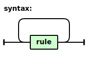
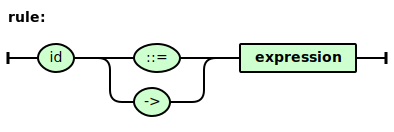
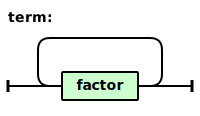
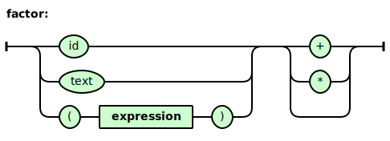

# railroad-diagram-generator

A tool for generating railroad diagrams. The EBNF grammar
used by the tool is described in doc/introduction/grammar.txt, and
you can find some samples under directory sample/.

## Sample

The EBNF grammar of `EBNF`:

    syntax      ::= ( rule )+
    rule        ::= 'id' ( '::=' | '->' ) expression
    expression  ::= term ( '|' term )* ( '|' | )
    term        ::= ( factor )+
    factor      ::= ( 'id' | 'text' | '(' expression ')' ) ( '+' | '*' | )

The railroad diagrams of `EBNF`:

