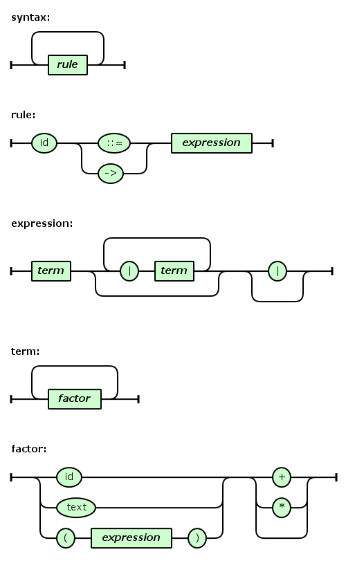

# railroad-diagram-generator

A tool for generating railroad diagrams. The EBNF grammar used by the tool is described in doc/introduction/grammar.txt, and you can find some samples under directory sample/.

## Sample

The EBNF grammar of `EBNF`:

    syntax      ::= ( rule )+
    rule        ::= 'id' ( '::=' | '->' ) expression
    expression  ::= term ( '|' term )* ( '|' | )
    term        ::= ( factor )+
    factor      ::= ( 'id' | 'text' | '(' expression ')' ) ( '+' | '*' | )

    id is any string of alpha([a-zA-Z]) characters or number([0-9]) characters or underscores ('_')
    text is any double-quoted string("...") or signle-quoted string('...') without newline('\n')

The railroad diagrams of `EBNF`:

